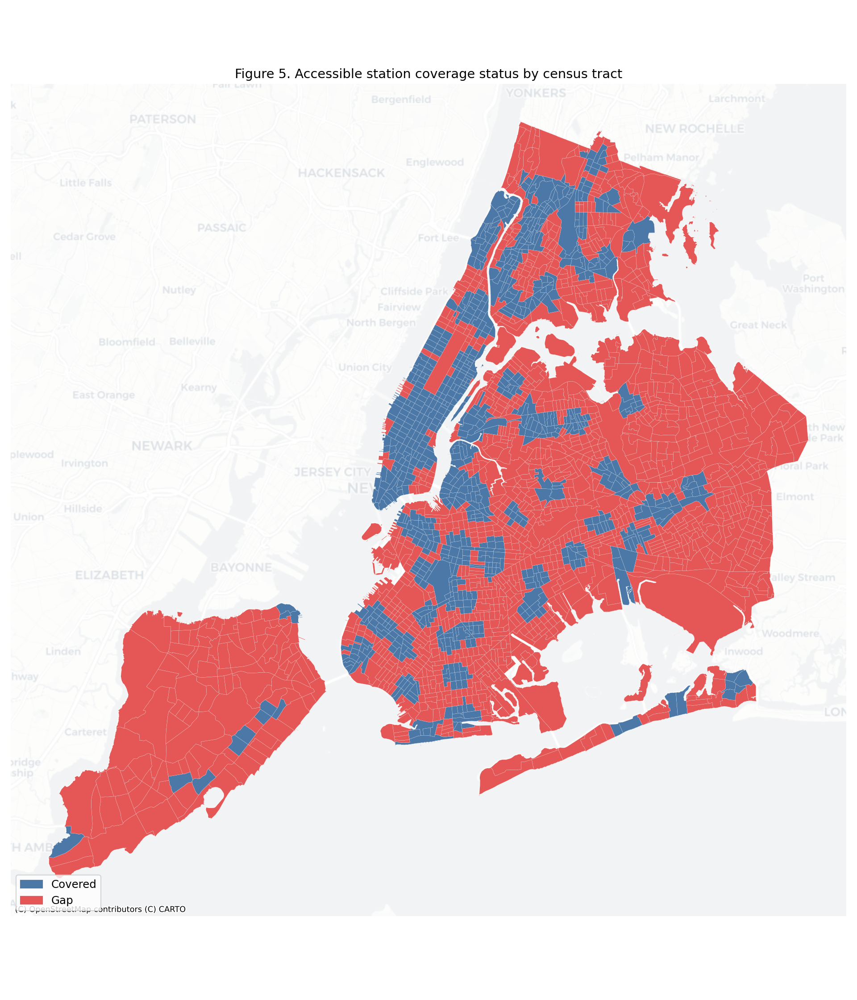
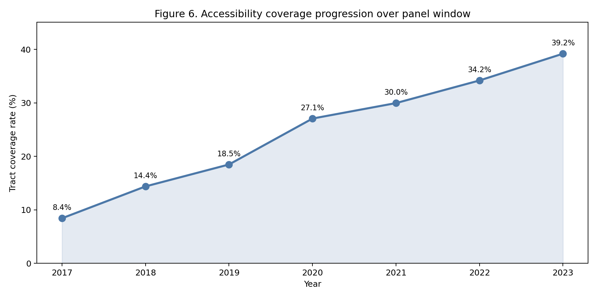
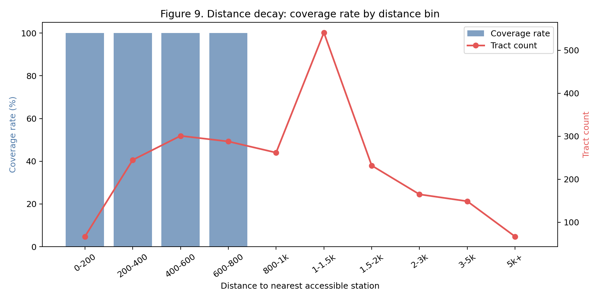
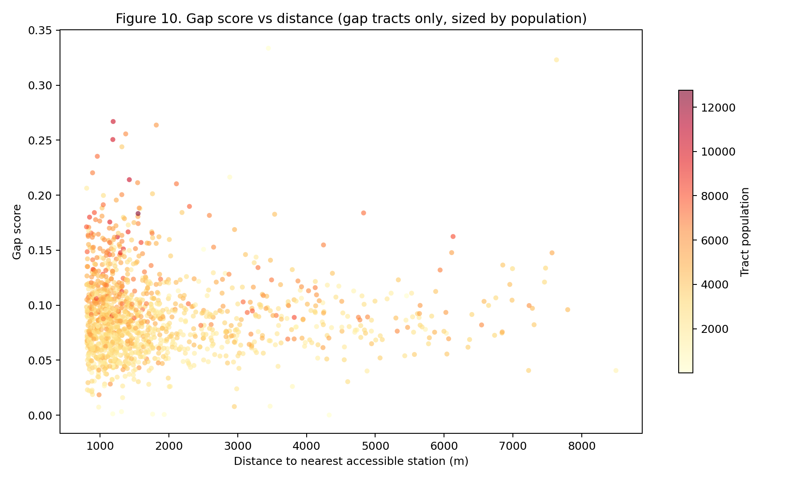
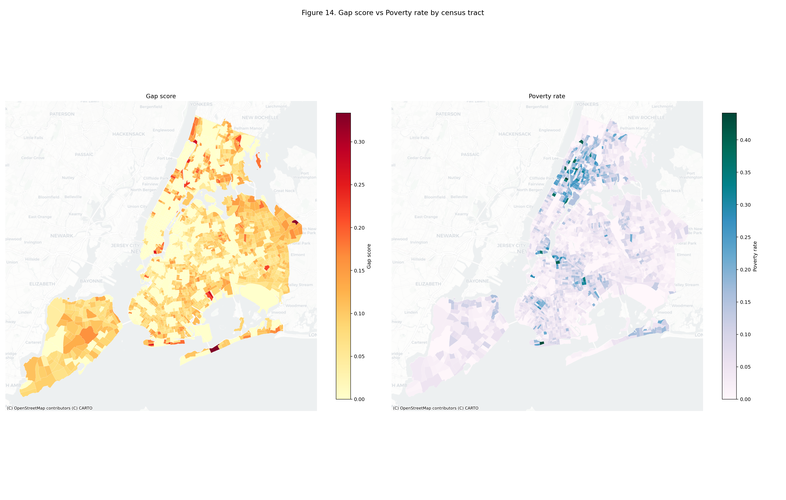

# Accessibility Change Over Time

*Report generated: April 9, 2026*

| | |
| :--- | :--- |
| **Boroughs** | Manhattan, Brooklyn, Queens, Bronx, Staten Island |
| **Stations & ADA status** | MTA Open Data, fetched April 9, 2026 |
| **Outage observation window** | May 2025 – April 9, 2026 (12 months) |
| **Demographics** | ACS 5-year estimates, 2023 vintage (survey period 2019–2023) |
| **Census tract boundaries** | 2020 vintage (nyc-geo-toolkit) |
| **Tracts analyzed** | 2,317 |
| **Panel periods** | 7 (2017–2023) |

---

## What this means for New Yorkers

- **4,717,140 New Yorkers** (55% of the city) live more than a 10-minute walk from any ADA-accessible subway station.
- Only **157 of 493 stations** (32%) are wheelchair-accessible. If you use a wheelchair, cane, stroller, or have trouble with stairs, two-thirds of stations are off-limits.
- **Queens** has the largest gap: 1,752,073 residents without accessible station coverage.
- Even among accessible stations, **49 have elevators down more than 5% of the time**. 59 St-Columbus Circle had just 0% uptime (May 2025 – April 9, 2026).

## Table 1. System-wide snapshot

| Metric | Value |
| :--- | ---: |
| Subway stations | 493 |
| ADA-accessible stations | 157 (32%) |
| Census tracts analyzed | 2,317 |
| Tracts with accessible coverage | 901 (39%) |
| Tracts in accessibility gap | 1,416 (61%) |
| Population in gap tracts | 4,717,140 |
| Total study population | 8,507,596 |

## Table 2. Borough comparison


| Borough | Stations | ADA | Tracts | Covered | Gap pop | Avg dist |
| :--- | ---: | ---: | ---: | ---: | ---: | ---: |
| Manhattan | 151 | 61 | 309 | 238 (77%) | 361,154 | 584 m |
| Brooklyn | 169 | 43 | 800 | 326 (41%) | 1,467,660 | 1,007 m |
| Queens | 82 | 26 | 723 | 159 (22%) | 1,752,073 | 1,966 m |
| Bronx | 70 | 21 | 360 | 167 (46%) | 690,126 | 980 m |
| Staten Island | 21 | 6 | 125 | 11 (9%) | 446,127 | 2,983 m |


## Geographic distribution


The gap score map (Figure 4) shows where high-need tracts lack accessible stations. Darker red areas have both high demographic need and no accessible station within walking distance.



The binary coverage map (Figure 5) shows the stark geographic divide: blue tracts have at least one accessible station within a 10-minute walk, red tracts do not.

## Reliability analysis

Nominal coverage counts any ADA station within the catchment. Reliability-weighted coverage discounts by uptime: a station with 50% elevator uptime provides 0.50 effective coverage.


### Table 3. Most fragile accessible stations

| Station | Borough | Uptime | Outage (min) |
| :--- | :--- | ---: | ---: |
| 59 St-Columbus Circle | Manhattan | 0.0% | 525,600 |
| Lexington Av/53 St | Manhattan | 9.3% | 476,611 |
| 42 St-Port Authority Bus Terminal | Manhattan | 13.6% | 454,320 |
| 34 St-Hudson Yards | Manhattan | 32.8% | 353,442 |
| Court Sq | Queens | 47.8% | 274,477 |
| 34 St-Herald Sq | Manhattan | 51.3% | 256,130 |
| 86 St | Manhattan | 56.7% | 227,508 |
| Fulton St | Manhattan | 60.5% | 207,369 |
| Cortlandt St | Manhattan | 61.6% | 202,044 |
| 72 St | Manhattan | 64.6% | 185,904 |
| Times Sq-42 St | Manhattan | 68.2% | 167,158 |
| Sutphin Blvd-Archer Av-JFK Airport | Queens | 71.5% | 149,726 |
| Lexington Av/63 St | Manhattan | 72.3% | 145,840 |
| Gun Hill Rd | Bronx | 72.9% | 142,511 |
| Grand Central-42 St | Manhattan | 75.2% | 130,558 |

*49 accessible stations system-wide had <95% uptime during the May 2025 – April 9, 2026 observation window.*

## Temporal panel



### Table 4. Coverage progression

| Year | Covered tracts | Rate | Covered pop |
| :--- | ---: | ---: | ---: |
| 2017 | 195 | 8.4% | 860,421 |
| 2018 | 333 | 14.4% | 1,346,266 |
| 2019 | 428 | 18.5% | 1,716,457 |
| 2020 | 627 | 27.1% | 2,615,174 |
| 2021 | 694 | 30.0% | 2,894,529 |
| 2022 | 792 | 34.2% | 3,345,549 |
| 2023 | 908 | 39.2% | 3,824,813 |

## Treatment vs control

Treatment: tracts that gained an accessible station during the panel window (908 tracts). Control: tracts with no accessible station coverage in any period (1,409 tracts).


### Table 5. Balance check

| Variable | Treatment | Control | Diff | Cohen's d | p-value | |
| :--- | ---: | ---: | ---: | ---: | ---: | :--- |
| Disability rate | 0.0484 | 0.0389 | +0.0095 | 0.270 | < 0.001 | *** |
| Senior rate | 0.1512 | 0.1623 | -0.0111 | -0.133 | 0.002 | ** |
| Poverty rate | 0.0739 | 0.0555 | +0.0184 | 0.292 | < 0.001 | *** |
| Need score | 0.0912 | 0.0856 | +0.0056 | 0.136 | 0.001 | ** |
| Population | 3,824,813 | 4,682,783 | | | | |

*Welch's t-test (unequal variance). Cohen's d: |d| < 0.2 negligible, 0.2–0.5 small, 0.5–0.8 medium, > 0.8 large.*

**Key finding:** Treatment tracts have modestly higher need scores than control tracts, suggesting ADA upgrades are reaching higher-need neighborhoods -- the right direction for equity. However, the imbalance also means a naive comparison would overstate the accessibility benefit; the DiD specification with fixed effects is essential for causal identification.

## Diagnostic checks


The need score distribution (Figure 8) is right-skewed, which is expected: most tracts have moderate need, while a tail of high-need tracts drives the accessibility gap. The median is below the mean, confirming the skew.



The distance decay curve (Figure 9) validates the 10-minute (800 m) catchment threshold: coverage drops sharply beyond 800 m and is near zero past 1.5 km. This confirms the walk-time assumption is not overly generous.



The gap-distance scatter (Figure 10) shows that gap scores increase with distance from the nearest accessible station, as expected. Larger dots (higher population) appear across all distance ranges, meaning high-population tracts are affected at every distance -- not just at the periphery.

### Table 6. Summary diagnostics

| Statistic | Need score | Distance (m) | Gap score |
| :--- | ---: | ---: | ---: |
| N | 2,317 | 2,317 | 1,346 |
| Mean | 0.0878 | 1353 | 0.0900 |
| Median | 0.0849 | 995 | 0.0853 |
| Std dev | 0.0411 | 1255 | 0.0367 |
| Skewness | 0.73 | 2.31 | 1.34 |
| Kurtosis (excess) | 2.41 | 6.12 | 4.24 |
| Jarque-Bera | 769.9 (p < 0.001) | 5672.3 (p < 0.001) | 1408.2 (p < 0.001) |
| Min | 0.0000 | 20 | 0.0001 |
| Max | 0.3336 | 8499 | 0.3336 |

**Spatial weights:** 2,317 units, 2,315 with neighbors (2 km threshold), mean 47.9 neighbors per unit.

## Correlation and equity analysis


The correlation heatmap (Figure 11) reveals the structure of association among demographic and accessibility variables. See the [full correlation analysis](./supplementary/correlation-analysis.md) for Pearson and Spearman matrices with p-values, VIF diagnostics, and OLS regression results.


**Equity regression:** senior_rate is the strongest demographic predictor of gap score (R² = 0.202, F = 108.8, p < 0.001). See [correlation analysis](./supplementary/correlation-analysis.md) for full regression table.

### Spatial autocorrelation summary

| Variable | Moran's I | z-score | p-value | |
| :--- | ---: | ---: | ---: | :--- |
| Gap Score | 0.2271 | 40.87 | 0.001 | ** |
| Need Score | 0.1991 | 33.91 | 0.001 | ** |
| Disability Rate | 0.2757 | 48.92 | 0.001 | ** |

See [spatial diagnostics](./supplementary/spatial-diagnostics.md) for full spatial weights summary and interpretation.

### Geographic comparison




## Model specification

The panel dataset supports difference-in-differences (DiD) estimation:

```
Y_it = alpha + beta * Treatment_it + gamma * X_it + delta_i + tau_t + epsilon_it
```

| Symbol | Description |
| :--- | :--- |
| Y_it | Outcome: population change, demographic composition, or housing cost |
| Treatment_it | 1 if tract *i* has an accessible station by period *t* |
| X_it | Time-varying covariates: disability rate, senior rate, poverty rate |
| delta_i | Tract fixed effects (absorb time-invariant tract characteristics) |
| tau_t | Period fixed effects (absorb city-wide trends) |
| beta | **Causal estimate:** effect of gaining an accessible station |

For spatial dependence, extend to SAR panel:

```
Y_it = rho * W * Y_it + beta * X_it + delta_i + tau_t + epsilon_it
```

Where *W* is the row-standardized distance-based spatial weights matrix (2,317 units, mean 47.9 neighbors).

## Policy implications

1. **Scale of the problem.** 4,717,140 New Yorkers lack accessible transit within walking distance. This is not a marginal issue -- it affects more people than the entire population of most US cities.

2. **Borough inequity.** Queens alone accounts for 1,752,073 residents in gap tracts. The outer boroughs bear a disproportionate burden of inaccessibility.

3. **Reliability undermines nominal progress.** Even among accessible stations, 49 have fragile elevator service (<95% uptime). A station that is "accessible" on paper but has broken elevators 40% of the time is not meaningfully accessible. Capital investment in new ADA stations must be paired with maintenance funding.

4. **Treatment targeting is directionally correct.** Tracts that have gained accessible stations have modestly higher disability and poverty rates than those that have not, suggesting the MTA's Capital Program is reaching higher-need areas. However, the gap remains enormous and the pace must accelerate.

## Supplementary analyses

- [Correlation analysis](./supplementary/correlation-analysis.md) — full Pearson and Spearman matrices, VIF, equity OLS regression
- [Model specification](./supplementary/model-specification.md) — DiD assumptions, balance tests with p-values, enhanced diagnostics
- [Spatial diagnostics](./supplementary/spatial-diagnostics.md) — Moran's I, spatial weights summary, clustering interpretation

## Methodology

**Data sources:**
- MTA Subway Station Catalog (Open Data NY, Socrata API)
- MTA Elevator & Escalator Availability History (May 2025 – April 9, 2026)
- American Community Survey 5-year estimates, 2023 vintage (survey period 2019–2023)
- NYC census tract boundaries (nyc-geo-toolkit, 2020 vintage)

**Accessibility model:**
- Catchment: 10-minute walk at 80 m/min = 800 m Euclidean radius
- A tract is "covered" if its centroid falls within any accessible station's catchment
- Need score = mean(disability_rate, senior_rate, poverty_rate)
- Gap score = need_score for uncovered tracts, 0 for covered tracts

**Limitations:**
- Euclidean distance overstates coverage vs actual walking routes
- Panel uses current ACS estimates repeated across vintage years (production would use actual multi-year ACS)
- Upgrade timeline is simulated from current ADA status; actual MTA Capital Program dates would strengthen causal identification
- First-and-last-mile barriers (stairs, curb cuts, sidewalk condition) are not captured

**Reproducibility:** `python main.py` regenerates all figures, tables, and this report from live API data.
