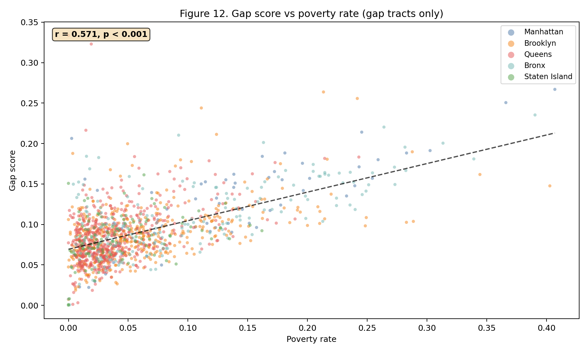
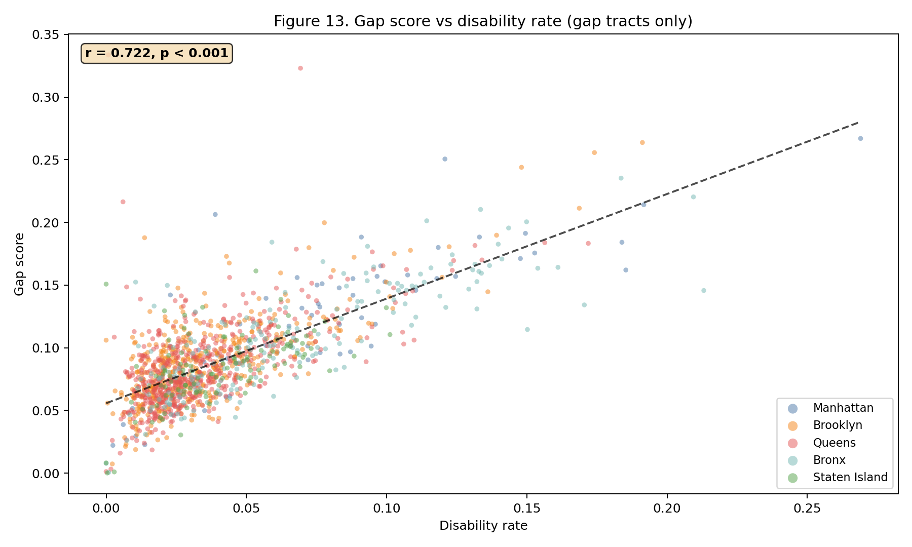

# Correlation Analysis

*Auto-generated: April 9, 2026*

This supplementary report provides full correlation matrices, multicollinearity diagnostics, and an OLS regression of gap score on demographic predictors.

## Pearson correlation matrix

| | Disability | Senior | Poverty | Need score | Gap score | Distance (m) |
| :--- | ---: | ---: | ---: | ---: | ---: | ---: |
| **Disability** | 1.000 | 0.180*** | 0.702*** | 0.763*** | 0.223*** | -0.112*** |
| **Senior** | 0.180*** | 1.000 | -0.114*** | 0.678*** | 0.402*** | 0.130*** |
| **Poverty** | 0.702*** | -0.114*** | 1.000 | 0.629*** | 0.154*** | -0.215*** |
| **Need score** | 0.763*** | 0.678*** | 0.629*** | 1.000 | 0.417*** | -0.052* |
| **Gap score** | 0.223*** | 0.402*** | 0.154*** | 0.417*** | 1.000 | 0.424*** |
| **Distance (m)** | -0.112*** | 0.130*** | -0.215*** | -0.052* | 0.424*** | 1.000 |

*Significance: \* p < 0.05, \*\* p < 0.01, \*\*\* p < 0.001*

## Spearman rank correlation matrix

| | Disability | Senior | Poverty | Need score | Gap score | Distance (m) |
| :--- | ---: | ---: | ---: | ---: | ---: | ---: |
| **Disability** | 1.000 | 0.219*** | 0.693*** | 0.727*** | 0.187*** | -0.151*** |
| **Senior** | 0.219*** | 1.000 | -0.095*** | 0.653*** | 0.365*** | 0.126*** |
| **Poverty** | 0.693*** | -0.095*** | 1.000 | 0.563*** | 0.099*** | -0.255*** |
| **Need score** | 0.727*** | 0.653*** | 0.563*** | 1.000 | 0.365*** | -0.064** |
| **Gap score** | 0.187*** | 0.365*** | 0.099*** | 0.365*** | 1.000 | 0.686*** |
| **Distance (m)** | -0.151*** | 0.126*** | -0.255*** | -0.064** | 0.686*** | 1.000 |

Spearman correlations are robust to non-linear monotonic relationships and outliers. Agreement with Pearson results indicates linear association is a reasonable approximation.

## Variance inflation factors (VIF)

| Variable | VIF |
| :--- | ---: |
| disability_rate | 2.28 |
| senior_rate | 1.17 |
| poverty_rate | 2.24 |

All VIF values are below 5 (max = 2.28), indicating no problematic multicollinearity among the demographic predictors.

## Bivariate scatter plots

## OLS regression: gap score on demographic predictors

Model: `gap_score = b0 + b1*poverty_rate + b2*disability_rate + b3*senior_rate`

N = 2,317, R² = 0.2024, Adj. R² = 0.2013, F = 108.83 (p < 0.001)

| Variable | Coefficient | SE | t | p-value | |
| :--- | ---: | ---: | ---: | ---: | :--- |
| const | -0.0000 | 0.0025 | -0.00 | 0.999 |  |
| poverty_rate | 0.1637 | 0.0328 | 4.99 | < 0.001 | *** |
| disability_rate | 0.0129 | 0.0628 | 0.21 | 0.837 |  |
| senior_rate | 0.2626 | 0.0165 | 15.93 | < 0.001 | *** |

**Strongest predictor:** senior_rate (|t| = 15.93). Robust standard errors (HC1) account for heteroskedasticity.
