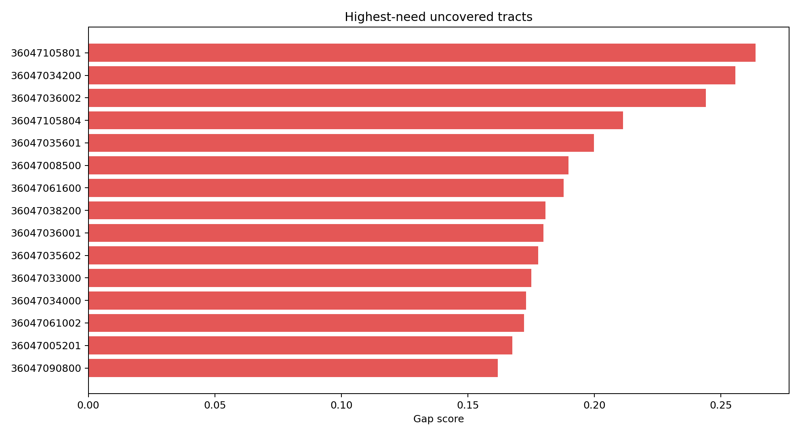
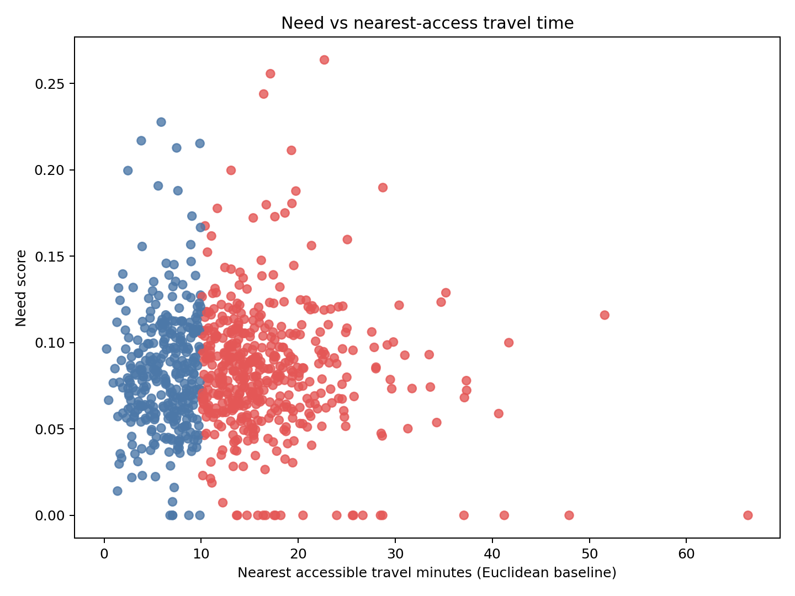
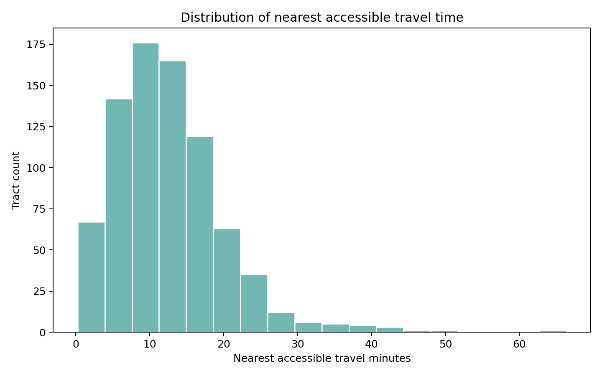

# Borough Gap Analysis Tearsheet

## Query

- Geography: `borough`
- Value: `Brooklyn`

## Snapshot

- Tracts scored: 800
- Uncovered tracts: 474
- Coverage rate: 40.8%
- Uncovered population: 1,467,660
- Highest gap tract: `36047105801` (Census Tract 1058.01; Kings County; New York)
- Highest gap score: 0.2637
- Nearest accessible station for top gap: Canarsie-Rockaway Pkwy

## Figures

### Top gap tracts

### Need vs nearest-access travel time

### Distribution of nearest-access travel time

## Artifact

- Gap CSV: `borough-accessibility-gaps.csv`
