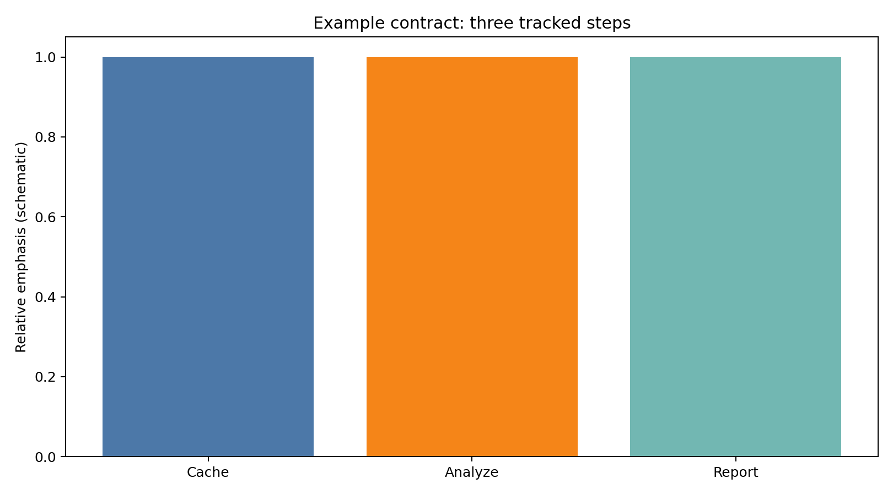

# Example Template Tearsheet

Bootstrap folder for new `subway-access` examples. Copy this directory, rename
it, wire `main.py` to real cache-backed workflows, and keep at least one chart
under `reports/figures/` so GitHub readers see a visual hook without running the
script.

## Figure

