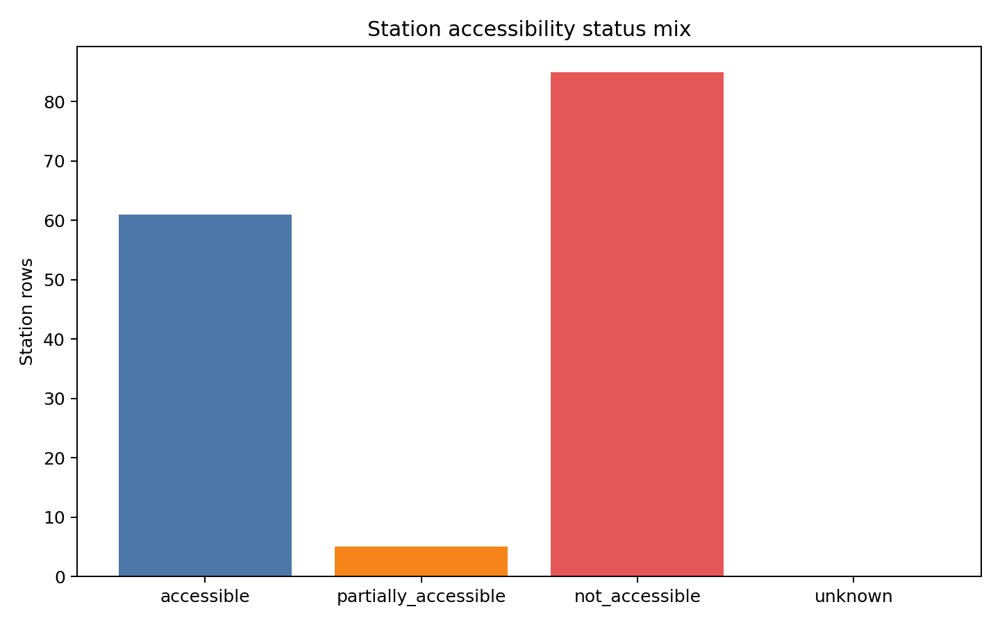
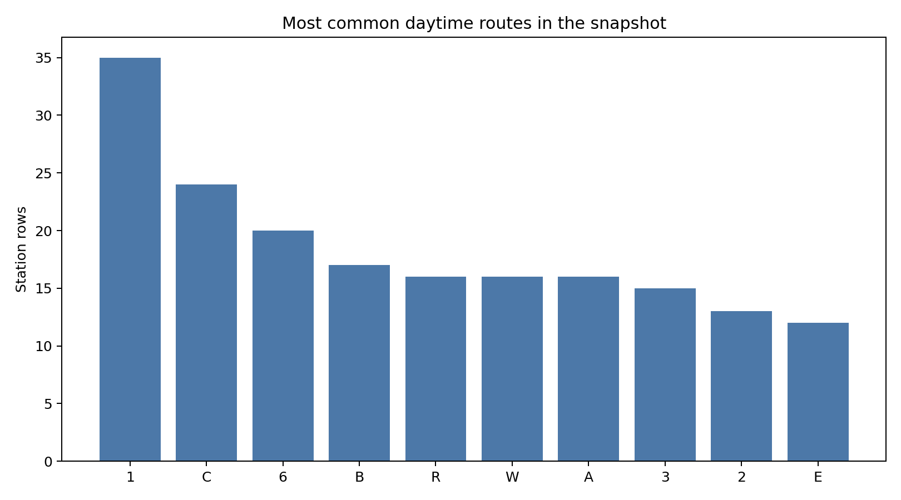
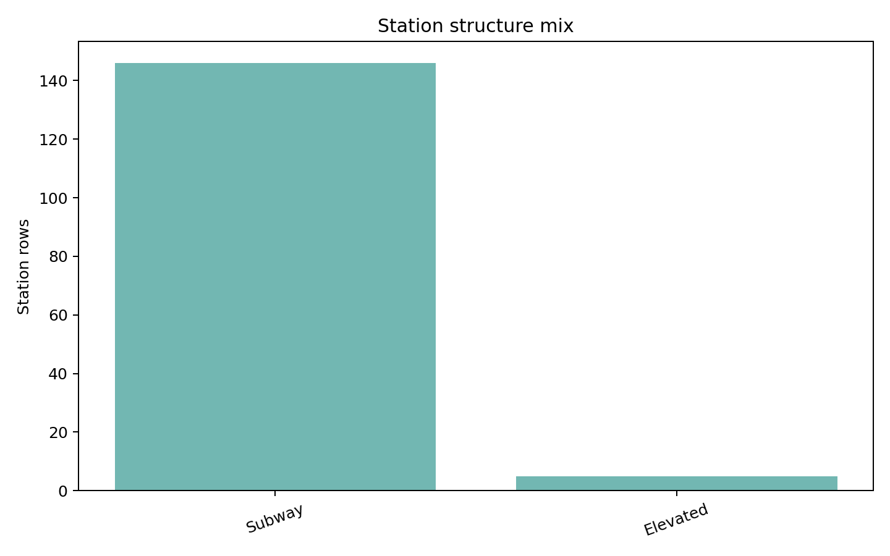

# Fetch Borough Snapshot Tearsheet

This tearsheet documents the current pinned real-data snapshot for the
`subway-access` beginner workflow.

## Executive Summary

- Study area: `borough = Manhattan`.
- Loaded `151` station rows and `309` tracts.
- Availability history rows: `3845`.
- Accessible station rows: `61`.
- Partial accessibility rows: `5`.
- Largest route family in the snapshot: `1` with `35` station rows.

## Source Cadence

- `mta_station_catalog` refreshed at `2026-04-04T18:39:29.705393+00:00` with `153` records.
- `mta_equipment_assets` refreshed at `2026-04-04T18:39:29.705393+00:00` with `404` records.
- `mta_availability_history` refreshed at `2026-04-04T18:39:29.705393+00:00` with `3845` records.
- `acs_tract_demographics` refreshed at `2026-04-04T18:39:29.705393+00:00` with `309` records.

## Figures

### Accessibility status mix

### Top routes in the snapshot

### Station structure mix

