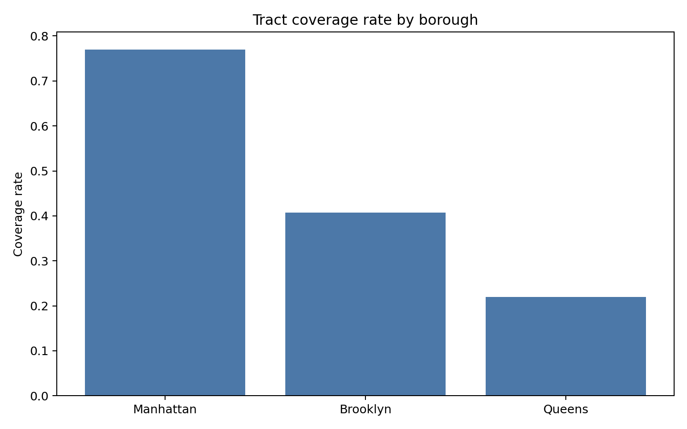
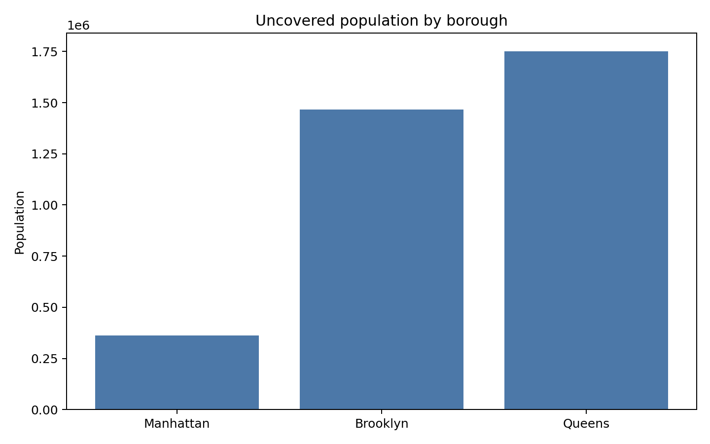
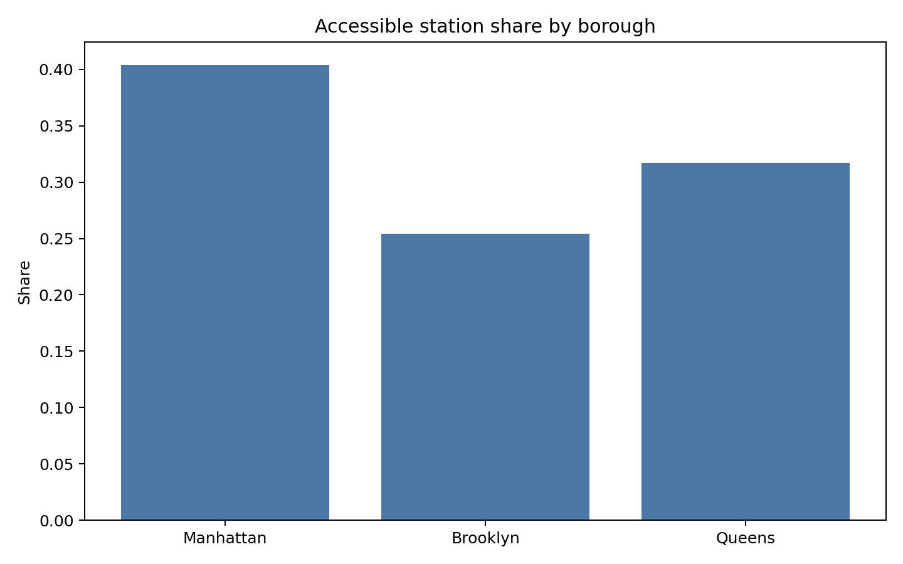
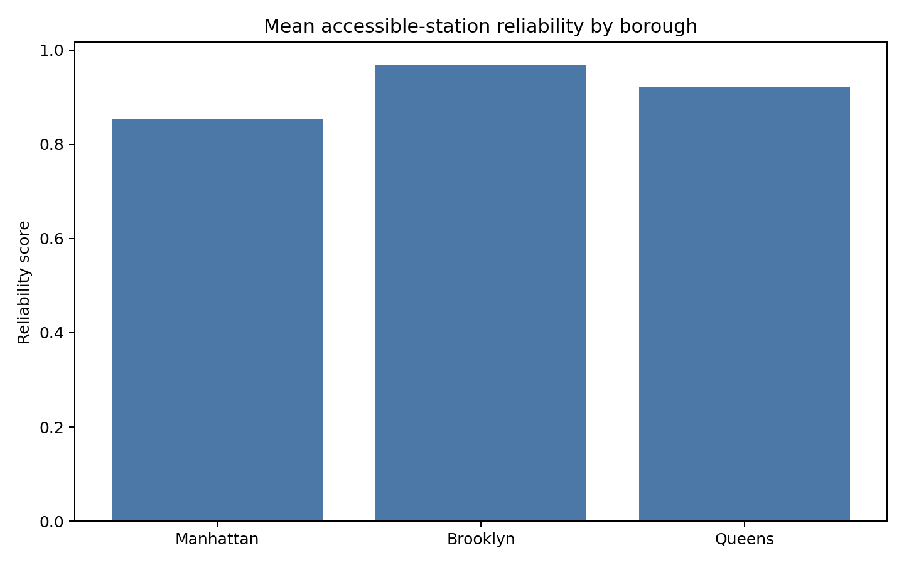

# Multi-Borough Access Profile Tearsheet

## Summary

- Boroughs compared: 3
- Highest coverage borough: `Manhattan`
- Highest uncovered population borough: `Queens`

## Figures

### Coverage rate by borough

### Uncovered population by borough

### Accessible station share by borough

### Mean accessible-station reliability by borough

## Artifact

- Borough profile CSV: `borough-profile.csv`
