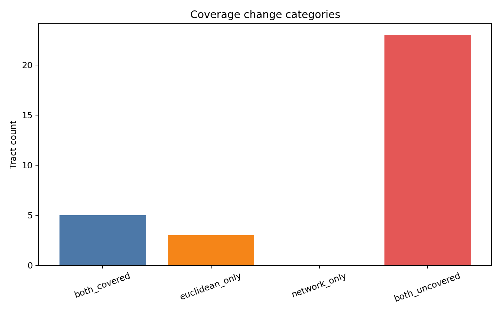
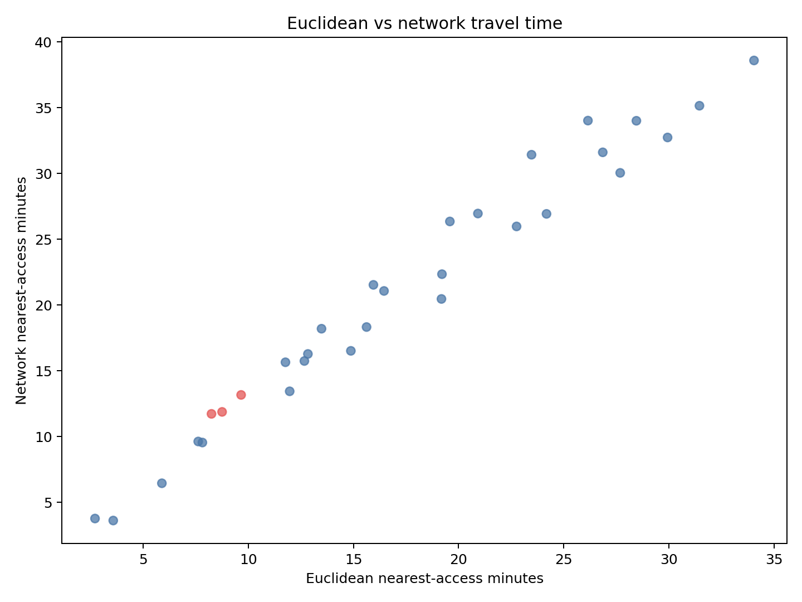
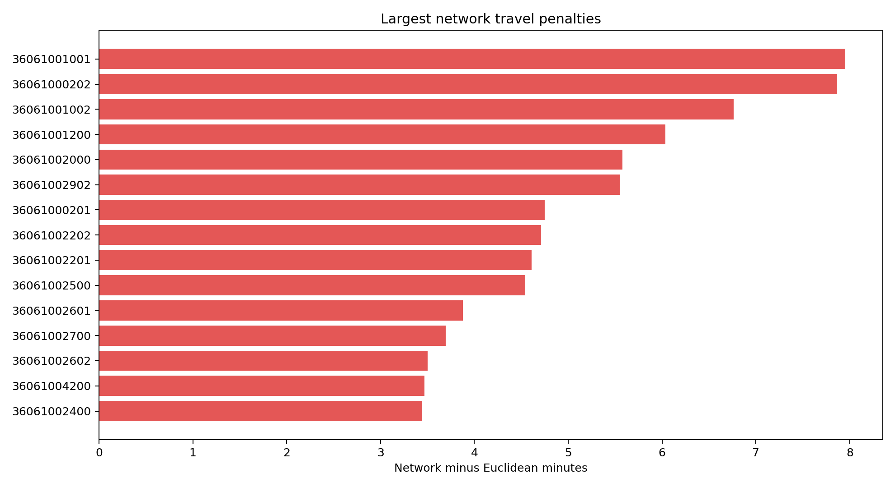

# Network Access Comparison Tearsheet

## Summary

- Tracts compared: 31
- Graph nodes: 4312
- Graph edges: 12700
- Euclidean-only tracts: 3
- Network-only tracts: 0

## Figures

### Coverage change categories

### Euclidean vs network travel time

### Largest network penalties

## Artifact

- Comparison CSV: `network-access-comparison.csv`
