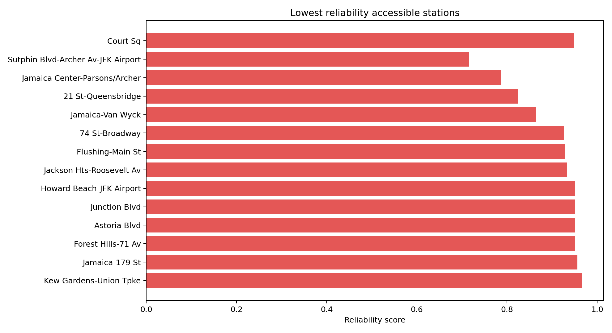
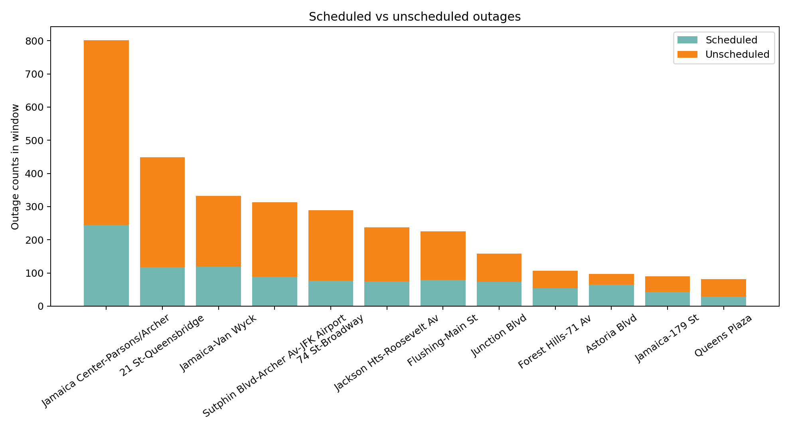
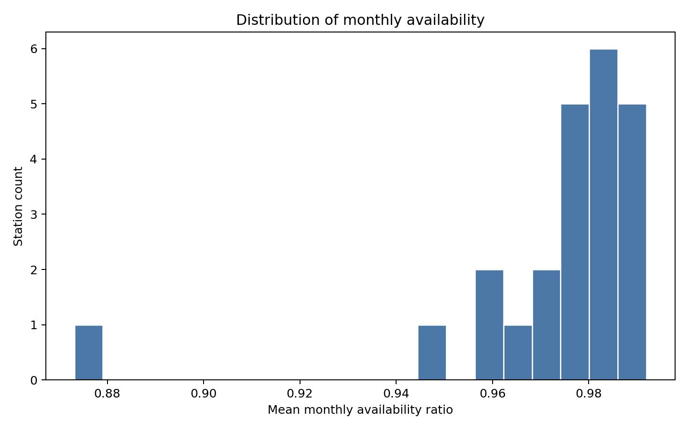

# Outage Reliability Report Tearsheet

## Query

- Geography: `borough`
- Value: `Queens`

## Reliability Snapshot

- Stations scored: 82
- Accessible stations scored: 26
- Fragile accessible stations: 9
- At-risk accessible stations: 11
- Lowest reliability station: `462` (Court Sq)
- Lowest reliability score: 0.4778
- Outage minutes in window: 274477

## Figures

### Lowest reliability accessible stations

### Scheduled vs unscheduled outages

### Distribution of mean availability

## Artifact

- Reliability CSV: `station-reliability.csv`
